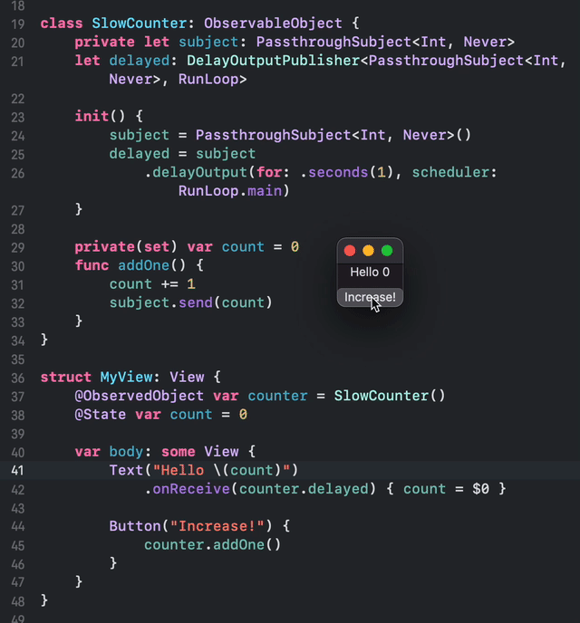

# DelayOutputPublisher

A Combine Publisher that limits throughput by inserting a delay between outputs.

Unlike `throttle(for:scheduler:latest:)` and `debounce(for:scheduler:options:)`
 `delayOutput(for:tolerance:scheduler:options:)` does not drop output elements.
 
 The first output element will be scheduled immediately. Subsequent elements
 will potentially be delayed by the specified interval.

## Usage

Use the Publisher's `delayOutput(for:tolerance:scheduler:options:)` method
to obtain a DelayOutputPublisher.

The first output will be scheduled immediately, any subsequent outputs will
be scheduled after the last output delivery completed
(after `subscriber.receive()` returned).
  
```swift
let df = DateFormatter()
df.dateStyle = .none
df.timeStyle = .medium

print("Start at \(df.string(from: Date()))")

let cancellable = (0..<4).publisher
    .delayOutput(for: .seconds(1), scheduler: RunLoop.main)
    .sink(
        receiveCompletion: { print("completed \($0)") },
        receiveValue: { value in
            print("Received \(value) after \(df.string(from: Date()))")
        })
```

Output
```
Start at 18:22:21
Received 0 after 18:22:21
Received 1 after 18:22:22
Received 2 after 18:22:23
Received 3 after 18:22:24
completed finished
```

A SwiftUI example showing how to limit 

```swift

class SlowCounter: ObservableObject {
    private let subject: PassthroughSubject<Int, Never>
    let delayed: DelayOutputPublisher<PassthroughSubject<Int, Never>, RunLoop>

    init() {
        subject = PassthroughSubject<Int, Never>()
        delayed = subject
            .delayOutput(for: .seconds(1), scheduler: RunLoop.main)
    }

    private(set) var count = 0
    func addOne() {
        count += 1
        subject.send(count)
    }
}

struct MyView: View {
    @ObservedObject var counter = SlowCounter()
    @State var count = 0

    var body: some View {
        Text("Hello \(count)")
            .onReceive(counter.delayed) { count = $0 }

        Button("Increase!") {
            counter.addOne()
        }
    }
}
```

## Demo



## Installation

### Package.swift

Edit the Package.swift file. Add the GamCenterUI as a dependency:
 
```
let package = Package(
    name: " ... ",
    products: [ ... ],
    dependencies: [
        .package(url: "https://github.com/berikv/DelayOutputPublisher.git", from: "0.0.0") // here
    ],
    targets: [
        .target(
            name: " ... ",
            dependencies: [
                "DelayOutputPublisher" // and here
            ]),
    ]
)
```

### For .xcodeproj projects

1. Open menu File > Add Packages...
2. Search for "https://github.com/berikv/DelayOutputPublisher.git" and click Add Package.
3. Open your project file, select your target in "Targets".
4. Open Dependencies
5. Click the + sign
6. Add DelayOutputPublisher
